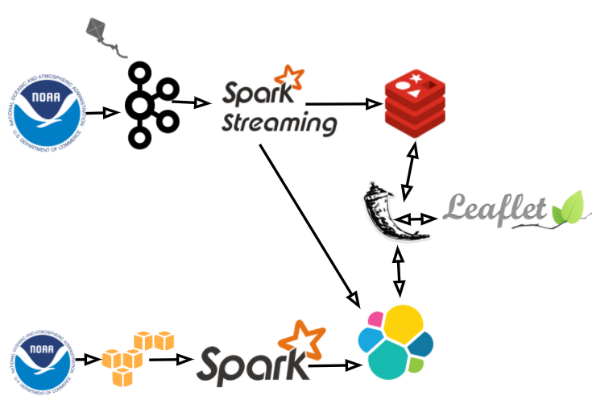

# Table of Contents

1. [Overview](README.md#overview)
2. [Batch](README.md#batch)
3. [Streaming](README.md#streaming)
4. [Pipeline](README.md#pipeline)
5. [Repository Structure](README.md#repository-structure)

##Overview
The following is my Go Fly a Kite (stream and batch wind data processing and analysis) Project, complete as part of the Insight Data Engineering Fellowship- Silicon Valley Winter 2017. 

The project Has to main parts. The batch portion which uses NOAA (National Oceanic & Atmospheric Administration) data to provide information about historical wind speeds at locations around the world. The second part, the streaming portion, produces messages using the NOAA current weather Api, and simulation to mimic a higher resolution of wind stations. The two branches allow the user to preform 5 queries.

1. Realtime wind Averages and Stoke % by location
2. Gradient of the wind, for the past hour at any location
3. If a particular region/location is in season or not
4. Input a location & radius and get the best place to currently fly a kite 
5. See how regions change throughout the year (seasonality)

[Web Application](goflyakite.us)

[Project Slides](http://bit.ly/2kI2YrX )

[Demo Video](https://youtu.be/XKJupWbfRaE)

##Batch
The batch portion of the pipeline uses S3, Spark, and Elasticsearch. The first part of moving the data though the pipeline was crawling noaa.gov website to download the historical weather files for the past 21 years into S3. Fortunately these files (.txt) were partitioned nicely (by month) keeping the max file size decently small 500mb. Amounting to almost 100gb in total. Spark then accesses these files as RDDs (Resilient Distributed Dataset), the data is in the form of text files with a header at the top. The header is split by word into an array and the indices of various terms are stored. The header is filtered out of the rdd, and lines individually split and only the indices corresponding to the selected values (wban, time, windspeed) in the header are kept using a simple ‘.map()’ function on the rdd. Because the weather files do not have longitude and latitude associated with the wban number I had to parse through the stations description files, extract the wban, longitude, and latitude and write it into a son file for easy access, this wasn’t very difficult because there are only about 3000 unique stations. Since the format of the header and text titles change /at various points throughout the past 21 years, there was a bit of a challenge in making the correct values for all of the files. 

In the reduce step, the data is reduced based on a key of the longitude, latitude, and date, and the list of times the wind was recorded is gathered along with a list of windspeed. This data is then written into Elasticsearch as a document. The Elasticsearch index the documents are stored in has a predefined schema to help decrease write time, the schema’s used for batch and streaming can be found in ‘/dev/es_index.txt’.

Once the data is in Elasticsearch the main query on the data is the seasonality of regions. Regions are created based on distance. Each location within the region is defined as being in or out of season depending on whether or not for that month (all of the years) more than 50% of the days had good enough wind to fly a kite (max windspeed 15mph). A regions is then rated, for sed month based on the percentage of locations within the region had good wind. You can view this at goglyakite.us/regions which corresponds to Queries 3 & 5 mentioned above.

##Streaming
I began my streaming pipeline by calling every location in the NOAA API, in order to get more data to test the throughput of my pipeline and simulate for a higher resolution, for each location/API I created over a thousand “fake” stations in the surrounding area. This data is produced to a kafka topic which is consumed by spark streaming. 

Two main computations need to be done on this data, the windowed standard deviation and average of the windspeed of each location. Instead of the normal standard deviation function (not one pass) which is not efficient in the map/reduce format, a one pass method for standard deviation was used. This was taken over a 2.5 min window. This data is stored in Redis and each time the previous value in Redis overwritten. This data is then queried through flask to get query 1 & 4 mentioned above.

The average of the streamed data also taken in a 1 hour window by location. Which is sent to  the streaming index in Elasticsearch. This data is used for query number 2 to find the gradient against the Redis data. At the end of the day a second batch process is run to aggregate the streamed elastic search data into the historical data section of the api. 
  

##Pipeline

##Repository Structure

- `./spark_batch/` contains all relevant files for replicating the batch section of the project

- `./spark_stream/` contains the relevant files for the streaming section

- `./get_streaming_wind` contains the files producing to kafka, making API call and simulating data based off of current wind status

- `./conf` contains configurations, IPs and passwords for communicating between clusters 

- `./app` contains the flask web app for communicating the users action to the databases

- `./dev` contains scripts commands used to run python scripts and set various schemas for the indices in ElasticSearch 
0

